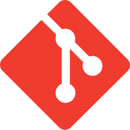
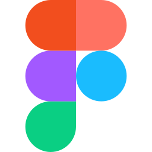

<h1 align="left">Hi there 👋, I'm Michael</h1>
<h3 align="left">A software developer and a Computer Science student at the Norwegian University of Science and Technology - NTNU.</h3>

  

- 🔭 I’m currently working on [NiclasNordlundPhotography](https://github.com/michaelbrusegard/NiclasNordlundPhotography), [WebGL Fluid Enhanced](https://github.com/michaelbrusegard/WebGL-Fluid-Enhanced) and [DevOps NTNU Hackerspace Website](https://github.com/hackerspace-ntnu/website).

- 🌱 I’m currently learning Algorithms & Datastructures, basic RISC-V Assembly, Google Cloud Storage + App-Engine, Firebase and java.

- 👯 I’m looking to collaborate on [RedditShortVideoMaker](https://github.com/michaelbrusegard/RedditShortVideoMaker).

- 🤔 I’m looking for help with any of my public repositories.

- 💬 Ask me about music, fitness & sport, gaming or anything tech related.

- 📫 How to reach me: dev@michaelbrusegard.com

- ⚡ My toolkit: Ctrl + C, Ctrl + V, and coffee.

<h3 align="left">Frontend:</h3>

  
  
  
  
  
  
  
  

<h3 align="left">Backend:</h3>

  
  
  
  
  
  

<h3 align="left">Integrations:</h3>

  
  
  
  

<h3 align="left">Tools:</h3>

  
  
  
  
  
  

<h3 align="left">Design:</h3>

  
  
  

 
 

 

&nbsp;

 

