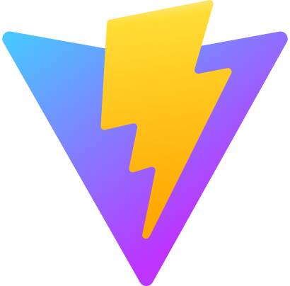
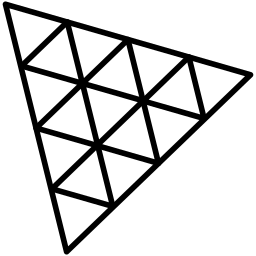
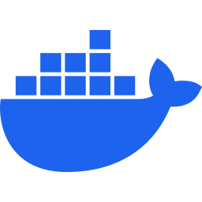
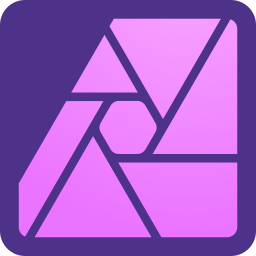

<h1 align="left">Hi there 👋, I'm Michael</h1>
<h3 align="left">A software developer and a Computer Science student at the Norwegian University of Science and Technology - NTNU.</h3>

  

- 🔭 I’m currently working on a secret fullstack web application using Next.js with tRCP + postgreSQL and the [DevOps Hackerspace NTNU Website](https://github.com/hackerspace-ntnu/website) which we are currently moving to react.

- 🌱 I’m currently learning tRPC, SQL and Docker.

- 👯 I’m looking to collaborate on [RedditShortVideoMaker](https://github.com/michaelbrusegard/RedditShortVideoMaker), the project has been dead for a while because I have so much going on.

- 🤔 I’m looking for help with any of my public repositories.

- 💬 Ask me about music, fitness & sport, gaming or anything tech related.

- 📫 How to reach me: dev@michaelbrusegard.com

- ⚡ My toolkit: Ctrl + C, Ctrl + V, and coffee.

<h3 align="left">Languages:</h3>

<h3 align="left">Frontend:</h3>

<h3 align="left">Backend:</h3>

<h3 align="left">Databases:</h3>

<h3 align="left">Infrastructure:</h3>

<h3 align="left">Tools:</h3>

 
 

 

&nbsp;

 

